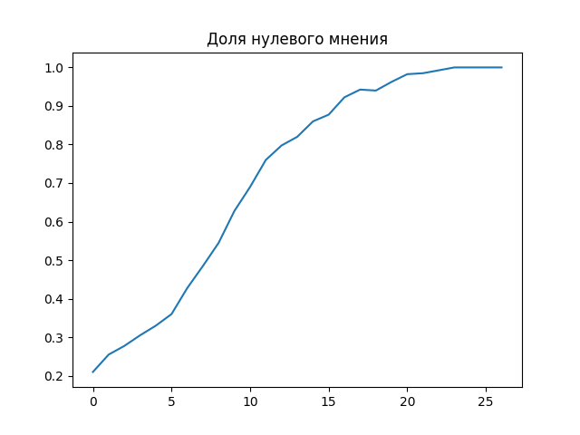

# opinion-simulation


## План

- [Installation](#installation)
- [Usage](#usage)


## Installation

### Шаг 1: Клонирование репозитория

1. Откройте терминал или командную строку.
2. Перейдите в каталог, где вы хотите клонировать проект.
3. Выполните команду `git clone` с URL репозитория
4. перейдите в каталог проекта `cd opinion-simulation`

### Шаг 2: Настройка окружения

1. Создайте удобным для вас способ окружение (venv)
2. В активированном окружении запустите в терминале
`pip install requirements.txt -q`


## Usage

### Конфигурирование

В директории `configs` находятся:
1. Общий конфиг
```json
{
    "grids_n": 20,
    "cell_size": 20,
    "show": 1,
    "window_name": "my game"
}
```
`grids_n` - размер поля
`cell_size` - размер клетки в пикселях (для визуализации)
`show = 0 или 1` - включение визуализации в отдельном окне
`window_name` - название окна

2. Конфиги стартовых полей (уже есть 4, но можно создать новые с помощью `create_fields.ipynb`)

Конфиг состоит из двух файлов `json`: `field.json` и `opinion_matrix.json`. Там записаны матрицы для стартовых значений мнений и для типов каждого агента (конформист | нонконформист | фиксированное мнение). Немного подробнее про матрицы можно увидеть в `create_fields.ipynb`

### Запуск

Запуск программы происходит в `run.ipynb`
Для запуска необходимо указать путь до конфига и настроить параметры, подробнее про которые можно увидеть в самом ноутбуке.

### Результат
После выполнения всех ячеек кода из `run.ipynb` в директории для результатов (по умолчанию `results`) будет создана директория с названием конфига начального поля + типа получения соседей. Внутри нее будет json со статистикой, график изменения доли мнений и картинки поля каждые 10 итераций (при необходимости)



### Дополнительная информация
Классы находятся в `field.py`. Функции для создания поля в `create_field.py`
