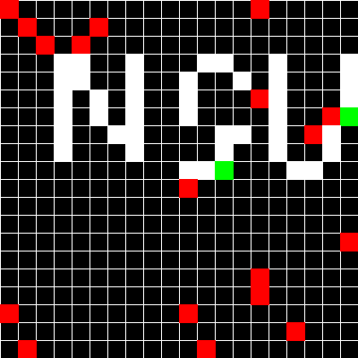
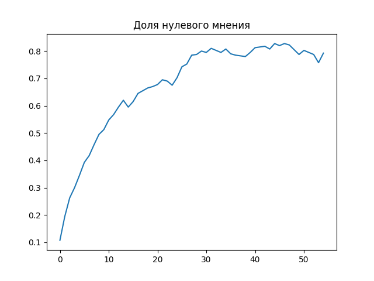
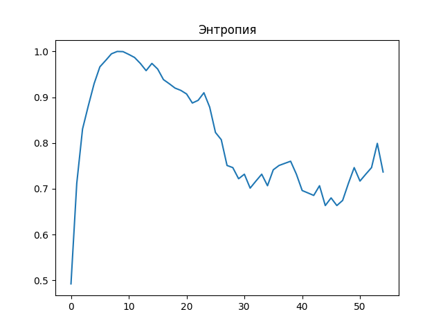

# opinion-simulation





## План

- [Installation](#installation)
- [Usage](#usage)


## Installation

### Шаг 1: Клонирование репозитория

1. Откройте терминал или командную строку.
2. Перейдите в каталог, где вы хотите клонировать проект.
3. Выполните команду `git clone` с URL репозитория
4. Перейдите в каталог проекта `cd opinion-simulation`

### Шаг 2: Настройка окружения

1. Создайте удобным для вас способ окружение (venv)
2. В активированном окружении запустите в терминале
`pip install requirements.txt -q`


## Usage

### Конфигурирование

В директории `configs` находятся:
1. Конфиг для визуализации `cfg_vis.json`
```json
{
    "cell_size": 20,
    "show": 1,
    "window_name": "my game"
}
```
`cell_size` - размер клетки в пикселях (для визуализации)
`show = 0 или 1` - включение визуализации в отдельном окне
`window_name` - название окна

2. Конфиги стартовых полей (уже есть 5, но можно создать новые с помощью `create_fields.ipynb`).

```json
{
    "iterations": 20,
    "field_type": "Ring",
    "field_size": 20,
    "field": "[[0, 1, ...,  0], ..., [1, 1, ..., 0]]",
    "opinions": "[[0, 2, ...,  0], ..., [1, 2, ..., 0]]"
}
```
`iterations` - кол-во итераций
`field-type` - тип поиска соседей для всех клеток ('Ring' | 'Cross')
`field_size` - размер поля
`field` - матрица изначальных мнений
`opinions` - матрица типов мнений (конформисты | нонконформисты | фиксированные)

Подробнее про эти матрицы можно увижеть в `create_fields.ipynb`

### Добавление своего конфига

В `configs` необходимо создать папку под свой конфиг и добавить в нее json файл

### Запуск

Запуск программы происходит в `run.ipynb`
Для запуска необходимо указать путь до конфига и настроить параметры, подробнее про которые можно увидеть в самом ноутбуке.

### Результат
После выполнения всех ячеек кода из `run.ipynb` в директории для результатов (по умолчанию `results`) будет создана директория с названием конфига начального поля. Внутри нее будет json со статистикой; графики изменения доли мнений и энтропии; картинки поля каждые 10 итераций (при необходимости)




### Дополнительная информация
Классы находятся в `field.py`. Функции для создания поля в `create_field.py`
